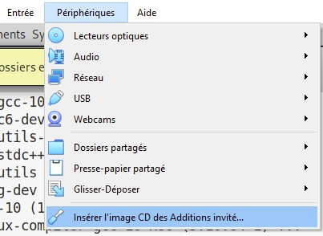
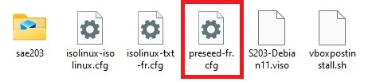
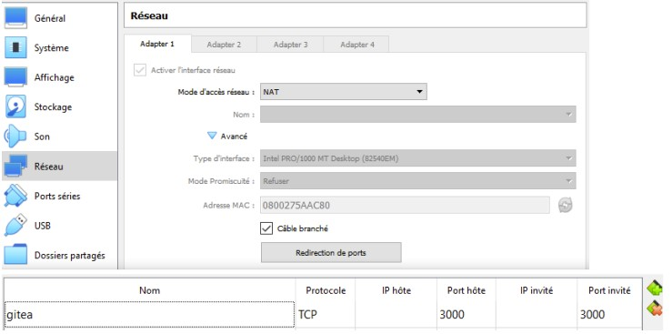
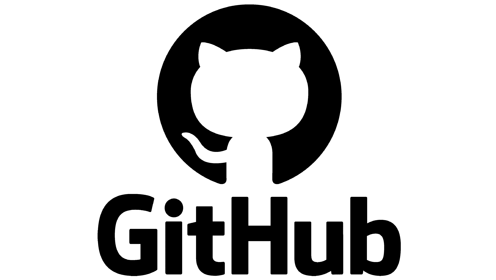
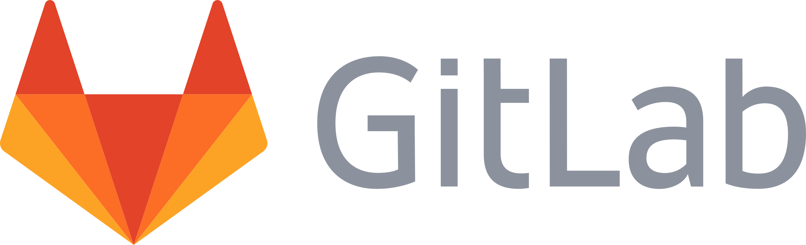
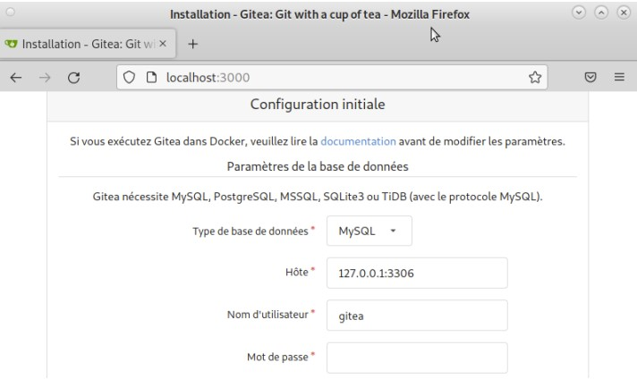
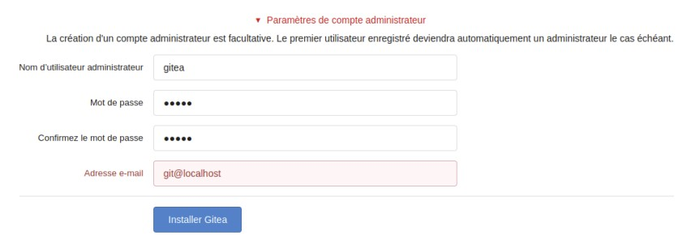

\newpage


# **Preparation d'une machine virtuelle Debian** <a id="partie-1"></a>

## **Creation de la machine virtuelle**

Caractéristiques à respecter lors de la création de la machine virtuelle

- Nom de la machine dans VirtualBox : *sae203*

- Dossier de la machine :

```bash
/usr/local/virtual_machine/infoetu/login
```

- Type : *Linux*
- Version : *Debian ou Debian 11 en 64-bit*
- Mémoire vive (RAM) : *2048 Mo pour être à l’aise à l’usage.*
- Disque dur : *20 Go entier (une seule partition)*
- Laisser le reste par défaut

*Question(s) 1. Configuration matérielle dans VirtualBox*

- Que signifie “64-bit” dans “Debian 64-bit” ?

```
Les 64 bit signifient l'utilisation d’un processeur de 64 bits 
```

- Quelle est la configuration réseau utilisée par défaut ?

```
La configuration réseau par défaut est de type NAT (Network Address Translation)
```

- Quel est le nom du fichier XML contenant la configuration de votre machine ?

```
Le fichier XML ne comporte plus l’extension de fichier .xml. Depuis la mise à jour 
4.0 de VirtualBox, le fichier se trouvant avant en .xml, est maintenant en .vbox.
Il comporte comme nom, le nom que porte la VM, ainsi, notre fichier se nomme sae203.vbox 
et il se trouve dans le fichier de la VM.
```

- Sauriez-vous le modifier directement ce fichier pour mettre 2 processeurs à votre machine ?
Faites-le.

```
Pour modifier le nombre de cœurs de la machine virtuelle, il faut modifier la 
ligne 20 du fichier XML. <CPU count=”...”>

Pour mettre deux processeurs a notre machine, il faudra mettre <CPU count=”2”>
```

## **Installation de l'OS**

Pour cette installation il vous faut d'abord télécharger une iso bootable d'une installation de *Debian 11*, pour ce faire vous la trouverez sur le site officiel de [Debian](https://www.debian.org).
Par la suite il vous faudra utiliser l'interface graphique de Virtualbox et insérer le fichier iso d’installation de votre Debian que vous venez de télécharger dans le cdrom virtuel.

Vous pouvez maintenant allumez votre machine virtuelle et commencez l'installation de votre OS avec les informations ci-dessous.

*Caractéristiques à considérer :*

- Nom de la machine (à l'installation) : <span class="couleur">seveur</span>
- Domaine : Laisser vide
- Pays/Langue : <span class="couleur">France</span>
- Miroir : <span class="couleur">`http://debian.polytech-lille.fr`</span>
- Proxy (uniquement si l'installation est faite depuis le réseau de l'IUT) : <http://cache.univ-lille.fr:3128>
- Compte administrateur : <span class="couleur">root</span> / <span class="couleur">root</span>
- Un Compte utilisateur : <span class="couleur">User</span> / <span class="couleur">user</span> / <span class="couleur">user</span>
- Partition : 1 seule partition recouvrant le disque entier
- Sélection des logiciels de démarrage (Paquetages logiciels à préinstaller pour se simplifier la vie par la suite) :
  - Grub
  - environnement de bureau Debian
  - MATE (penser à décocher Gnome)
  - serveur web
  - serveur ssh
  - utilitaire usuels du système

En cas de soucis avec l'installation, vous pouvez vous référer à la section de la documentation Debian qui détaille la procédure : [guide Debian](https://www.debian.org/doc/manuals/debian-handbook/sect.installation-steps.fr.html).

>{#id .class width=40px}
><p class="txt"> Conseil</p>
>À la fin de la procédure d’installation, avant de relancer le système, assurez-vous que le lecteur optique soit vide (icône grisé en bas de la fenêtre de votre VM) sinon vous redémarrerez sur l’iso d’installation.

Une fois l'installation terminée, vouspouvez supprimer l'iso d'installation pour économiser de l'espace usr votre compte.

*Question(s) 2. Installation OS de base*

- Qu'est-ce qu'un fichier iso bootable

  ```
  Un fichier iso bootable est un fichier d’installation permettant la procédure 
  d’installation lors du lancement de l’ordinateur.
  ```

- Qu’est-ce que MATE ? GNOME ?

   ```
   MATE (prononcer maté à l'espagnole) est un environnement de bureau libre 
   utilisant (dans un premier temps) la boîte à outils GTK+ 3. x et destiné 
   aux systèmes d'exploitation apparentés à UNIX.
   ```

  ```
  GNOME est un environnement graphique pour plateformes GNU /Linux et Unix. 
  Projet démarré en 1997, il est un ensemble d'outils permettant d'exploiter 
  graphiquement votre ordinateur : gestionnaire de fichiers, utilitaires, 
  logithèque, clients mail, navigateur web, logiciels divers, etc.
  ```

- Qu’est-ce qu’un serveur web ?

  ```
  Un « serveur web » peut faire référence à des composants logiciels (software) 
  ou à des composants matériels (hardware) ou à des composants logiciels et 
  matériels qui fonctionnent ensemble.

  1. Au niveau des composants matériels, un serveur web est un ordinateur qui 
  stocke les fichiers qui composent un site web (par exemple les documents HTML, 
  les images, les feuilles de style CSS, les fichiers JavaScript) et qui les envoie 
  à l'appareil de l'utilisateur qui visite le site. Cet ordinateur est connecté à 
  Internet et est généralement accessible via un nom de domaine tel que mozilla.org.

  2. Au niveau des composants logiciels, un serveur web contient différents fragments 
  qui contrôlent la façon dont les utilisateurs peuvent accéder aux fichiers hébergés. 
  On trouvera au minimum un serveur HTTP.
  ```

- Qu’est-ce qu’un serveur ssh ?

  ```
  SSH est un protocole permettant d'établir une communication chiffrée, donc 
  sécurisée (on parle parfois de tunnel), sur un réseau informatique (intranet ou 
  Internet) entre une machine locale (le client) et une machine distante (le serveur).
  ```

- Qu’est-ce qu’un serveur mandataire ?

  ```
  Pour une définition du mot " proxy ", voir l'article proxy du Wiktionnaire. 
  Un serveur mandataire ou proxy (de l'anglais) est un serveur informatique 
  qui a pour fonction de relayer des requêtes entre un poste client et un serveur. 
  Les serveurs mandataires sont notamment utilisés pour assurer les fonctions suivantes:
    - mémoire cache ;
    - la journalisation des requêtes (" logging ") ;
    - la sécurité du réseau local ;
    - le filtrage et l'anonymat.
  L'utilité des serveurs mandataires est importante, notamment dans le cadre 
  de la sécurisation des systèmes d'information.
  ```

\newpage

# **Préparation du système**

## **Accès sudo pour user**

L'accès au groups sudo va nous permettre de simplifier la gestion du système, cependant en temps réél ce n'est pas obligatoire et peut même être considéré comme une fragilité

Suivez ces étapes :

- Passer en mode console : Ctrl + Alt + F1 (si cela vous met en pleine écran, vous n’êtes pas dans la console de la machine virtuelle)
- Se connecter en root : login = root et mot de passe = root
  Ajouter le groupe sudo à votre principal (pensez à indiquer dans le rapport la commande utilisée pour faire cette action)
  Recharger votre session. Vous pouvez maintenant utiliser la commande sudo avec le compte user.

  *Question(s) 3. sudo*
  
- Comment peux-t-on savoir à quels groupes appartient l'utilisateur user ?

  ```
    Premièrement, on peut trouver le groupe auquel appartient l'utilisateur 
    user dans le fichier /etc/group.
    Deuxièmement, on peut utiliser la commande groups afin de connaître le(s) 
    groupe(s) de l'utilisateur courant (si aucun nom d'utilisateur n'est mis 
    derrière la commande).
  ```

## **Installation des suppléments invité**

Pour ajouter les suppléments invités, nous allons devoir compiler des programmes. Il nous faut donc des outils de compilation et les fichiers d’en-têtes du noyaux linux utilisé :

*Suivez ces étapes :*

* Insérer le cd des suppléments : **Périphériques › Insérer l’image CD des additions invités…**

{#id .class width=300px}

* Monter le cd 

```bash
sudo mount /dev/cdrom /mnt
```

* Installer les suppléments
```bash
sudo /mnt/VBoxLinuxAdditions.run
```

* Rebooter et connecter-vous avec le compte user pour prendre en compte les suppléments.

Votre machine est maintenant prête pour une utilisation confortable

*Question(s) 4. Suppléments invités*

* Quel est la version du noyau Linux utilisé par votre VM ? N’oubliez pas, comme pour toutes les
questions, de justifier votre réponse.
```
Grâce à la commande : cat /proc/version 
Nous pouvons savoir la version de linux utiliser par la VM. Celle ci est 
la version 5.10.0-21-amd64
```

* À quoi servent les suppléments invités ? Donner 2 principales raisons de les installer.
```
Les additions invitées améliorent les performances du système d'exploitation 
invité et permettent une meilleure interaction entre la machine hôte 
et la machine invitée.
```

* À quoi sert la commande mount (dans notre cas de figure et dans le cas général) ?
```
La commande mount permet de demander au système d'exploitation de rendre 
un système de fichiers accessible, à un emplacement spécifié.
```

## **Précision sur le Proxy**

De manière générale, vous aurez à utiliser un proxy quand vous êtes au sein de l’université et pas à l’extérieure. En fait vous pourriez tout à fait utiliser un proxy tout le temps mais pas toujours celui de l’université (pour des raisons de sécurité, de traçage des données en transit …).
Détaillons plusieurs situations :

- À l’installation : Vous l’avez déjà fait dans le chapitre précédent.
- Pour un logiciel particulier : Certains logiciels peuvent gérer eux-même un proxy pour leur propre usage. Voici quelques exemples

**apt** 
> Le proxy se place dans le fichier <span class="couleur">`/etc/apt/apt.conf`</span> ou dans le répertoire <span class="couleur">`/etc/apt/apt.conf.d/`</span> (avec un fichier de nom quelconque). C’est ce qui est utilisé lors de l’installation de base. Le contenu doit bien sûr respecter un format particulier : <span class="couleur">`Acquire::http::proxy "http://cache.univ-lille.fr:3128";`</span>. 
> 
> Détails ici : [Options de configuration apt](https://www.debian.org/doc/manuals/debian-handbook/sect.apt-get.fr.html#sect.apt-config)

**git** 
> La commande git peut elle aussi utiliser un proxy spécifique qui pourra être placé par exemple dans la configuration globale avec la commande <span class="couleur">`git config --global http.proxy`</span> ou directement dans le fichier `~/.gitconfig section [http). 
> 
> Détails ici : [it paramètre http.proxy](https://git-scm.com/docs/git-config#Documentation/git-config.txt-httpproxy).

- Pour une configuration générale :
  - **Terminal** (v1) : Via les variables d’environnement du terminal :   
  > export http_proxy=<http://cache.univ-lille.fr:3128>
  >
  > export https_proxy=$http_proxy
  - **Terminal** (v2) : Ajouter la ligne précédente dans votre fichier <span class="couleur">`$HOME/.bashrc`</span> afin d’éviter d’avoir à la saisir à chaque fois.
Pour désactiver le proxy, dans les deux cas il vous suffit d’écrire : <span class="couleur">`unset http_proxy`</span> en ligne de commande.

- **Via MATE** : La configuration se trouve dans le menu “**Système** › **Préférences** › **Internet et réseau** › **Serveur mandataire**”.
Mettez la même url pour *HTTP* et *HTTP sécurisé*.

Pour le désactiver, il vous suffira de cocher l’option “Connexion directe à Internet” au même endroit

---

## **Référence**

- *Questions 1. Configuration matérielle dans VirtualBox*
- [Que signifie “64-bit” dans “Debian 64-bit” ?](https://fr.wikipedia.org/wiki/Processeur_64_bits) : Partie Systèmes d'exploitation 64 bits

-  *Questions 2. Installation OS de base*
- [Qu’est-ce qu’un fichier iso bootable ?](https://www.malekal.com/les-fichiers-iso/#:~:text=Les%20ISO%20sont%20généralement%20utilisés,bootable%20pour%20installer%20ce%20dernier.)
- Qu’est-ce que [MATE](https://mate-desktop.org/fr/#:~:text=MATE%20est%20un%20fork%20de,d%27exploitation%20similaires%20à%20Unix.) ? [GNOME](https://www.gnome.org) ? (Définition utile : [fork](https://developer.mozilla.org/fr/docs/Glossary/Fork))
- [Qu’est-ce qu’un serveur web ?](https://developer.mozilla.org/fr/docs/Learn/Common_questions/Web_mechanics/What_is_a_web_server)
- [Qu’est-ce qu’un serveur ssh ?](https://www.it-connect.fr/chapitres/quest-ce-que-ssh/)
- [Qu’est-ce qu’un serveur mandataire ?](https://www.futura-sciences.com/tech/definitions/internet-proxy-488/)
  
- *Questions 3.sduo*
- Comment peux-ton savoir à quels groupes appartient l’utilisateur user ?
  * Pour cette question nous avons utilisé le cours d'introduction systèmes, R1.04 de S1.

- *Questions 4.Suppléments invités*
- [Quel est la version du noyau Linux utilisé par votre VM ?](https://doc.ubuntu-fr.org)
- 
  

- [À quoi servent les suppléments invités ?](https://lecrabeinfo.net/virtualbox-installer-les-additions-invite-guest-additions.html#:~:text=Les%20additions%20invité%20(guest%20additions,hôte%20et%20la%20machine%20invité.))
- [À quoi sert la commande mount ?](https://www.ibm.com/docs/fr/power8?topic=commands-mount-command)

\newpage

# **Installation Debian automatisée par préconfiguration**

## **À propos de la distribution Debian**

- Qu’est-ce que le Projet Debian ? D’où vient le nom Debian ?
```
Le projet Debian est un groupe mondial de volontaires qui s'efforcent 
de produire un système d'exploitation qui soit composé exclusivement 
de logiciels libres. Le principal produit de ce projet est la distribution 
Debian GNU/Linux, qui inclut le noyau Linux ainsi que des milliers 
d'applications pré empaquetées. 
La prononciation officielle de Debian est « déb-yann ». Le nom tire son origine 
des prénoms du créateur de Debian, Ian Murdock, et de son épouse, Debra.
```

{#id .class width=300px}

## **La maintenance**
- Il existe 3 durées de prise en charge (support) de ces versions : la durée minimale, la durée en support long terme (LTS) et la durée en support long terme étendue (ELTS). Quelles sont les durées de ces prises en charge ?
```
      Debian Long Term Support (LTS), pour prise en charge à long terme, 
      est un projet pour étendre la durée de vie de toutes les versions 
      stables de Debian à (au moins) 5 ans. Debian LTS n'est pas gérée 
      par l'équipe chargée de la sécurité de Debian, mais par un groupe 
      distinct de bénévoles et sociétés intéressées pour en faire un succès. 

      La prise en charge à long terme étendue (ELTS) est une offre commerciale 
      offrant un prolongement de la durée de vie de 10 ans des versions 
      de Debian (c'est-à-dire de 5 ans après la prise en charge de 5 ans 
      offerte pas le projet LTS). Il ne s'agit pas d'un projet officiel 
      de Debian. L'infrastructure de Debian, et les autres ressources 
      de Debian ne sont pas impliquées.
```

- Pendant combien de temps les mises à jour de sécurité seront-elles fournies ? Nom générique, nom de code et version
```
L'équipe Debian LTS prendra en charge les mises à jour de sécurité des 
différentes versions une fois que l'équipe chargée de la sécurité aura 
terminé son travail.
```
## **Nom générique, nom de code et version**

- Combien de versions au minimum sont activement maintenues par Debian ? Donnez leur nom générique (= les types de distribution).
```
Il y a toujours au moins trois versions qui sont activement maintenues par debian:

  -  La distribution stable contient la dernière distribution 
  officiellement sortie de Debian.

  - La distribution testing contient les paquets qui n'ont pas encore 
  été acceptés dans la distribution stable, mais qui sont en attente de 
  l'être. Le principal avantage d'utiliser cette distribution est qu'elle 
  contient des versions plus récentes des logiciels.

  - La distribution unstable est celle sur laquelle les activités de 
  développement se déroulent. Généralement, cette distribution est utilisée 
  par les développeurs et par ceux qui aiment vivre sur le fil.
```

- Chaque distribution majeur possède un nom de code différent. Par exemple, la version majeur
actuelle (Debian 11) se nomme Bullseye. D’où viennent les noms de code données aux
distributions ?
```
Les versions successives de la distribution Debian portent à la fois un 
numéro de version traditionnel et des noms de code tirés des personnages 
du film Toy Story de Pixar/Disney (1995)
```

- L’un des atouts de Debian fut le nombre d’architecture officiellement prises en
charge. Combien et lesquelles sont prises en charge par la version Bullseye ?
```
La version Bullseye prend en charges 9 architecture différentes :

  - PC 64 bits (amd64)
  - ARM 64 bits (AArch64)
  - EABI ARM (armel)
  - ARM avec unité de calcul flottant (armhf)
  - PC 32 bits (i386)
  - MIPS (petit-boutiste)
  - MIPS 64 bits (petit-boutiste)
  - PowerPC 64 bits (petit-boutiste)
  - System z
```

- Première version avec un nom de code
  - Quelle a était le premier nom de code utilisé ?
  - Quand a-t-il été annoncé ?
  - Quelle était le numéro de version de cette distribution ?

- Dernière nom de code attribué
  - Quel est le dernier nom de code annoncée à ce jour ?
  - Quand a-t-il été annoncé ?
  - Quelle est la version de cette distribution ?

      |Version      |Nom de code|Distribution       |Date de publication |
      |-------------|:---------:|:-----------------:|:------------------:|
      |Première     |*Buzz*     |Debian 1.1         |Juin 1996           |
      |Dernière     |*Bullseye* |Debian 11.6        |17 Décembre 2022     |

## **Référence**

1. Qu’est-ce que le **[Projet Debian](https://www.debian.org/doc/manuals/project-history/intro.fr.html#begining)** ? D’où vient le nom **[Debian](https://www.debian.org/doc/manuals/project-history/intro.fr.html#pronouncing-debian)** ?

2. Il existe 3 durées de prise en charge (support) de ces versions : la durée minimale, la durée en **[support long terme (LTS)](https://wiki.debian.org/fr/LTS)** et la durée en **[support long terme étendue (ELTS)](https://wiki.debian.org/fr/LTS/Extended)**. Quelle sont les
durées de ces prises en charge ?

3. Pendant combien de temps les **[mises à jour](https://wiki.debian.org/fr/LTS)** de sécurité seront-elles fournies ?

4. Combien de version au minimum sont **[activement maintenues](https://www.debian.org/releases/index.fr.html)** par Debian ? Donnez leur nom générique (=les types de distribution).

5. Chaque distribution majeur possède un nom de code différent. Par exemple, la version majeur actuelle (Debian 11) se nomme Bullseye. **[D’où viennent les noms de code](https://wiki.debian.org/fr/DebianReleases)** données aux distributions ? 

6. L’un des atouts de Debian fut le nombre d’architecture officiellement prises en charge. Combien et **[lesquelles sont prises en charge par la version Bullseye](https://www.debian.org/releases/stable/)** ? 

7. **[Première](https://www.debian.org/doc/manuals/project-history/detailed.fr.html#rel-1)** version avec un nom de code

8. **[Dernier](https://www.debian.org/releases/stable/)** nom de code attribué


## **Installation préconfigurée**

### *Fichiers de pré-configuration*

- Après avoir récupérer l'archive <span class="couleur">autoinstall.zip</span> et l'avoir decompresser dans notre machine virtuelle

- Remplacer la chaîne @@UUID@@ par un identifiant unique universel. Le plus simple est d’exécuter
la commande ci-dessous en étant placé dans le même répertoire que votre fichier <span class="couleur">S203-Debian11.viso</span>.
.
```
sed -i -E "s/(--iprt-iso-maker-file-marker-bourne-sh).*$/\1=
$(cat /proc/sys/kernel/random/uuid)/" S203-Debian11.viso
```

- Insérer le fichier S203_Debian11.viso dans le lecteur optique (cd/dvd) de votre machine virtuelle 

- Démarrer la machine virtuelle et laissez l’installation se dérouler jusqu’au reboot.

- Testez les ajouts invités en vous connectant (user/user, ou root/root) puis en modifiant la taille de la fenêtre

Votre installation est pour le moment sans interface graphique.

*Question(s) 1.Ajustement de la pré-configuration*

Pour repondre aux différentes demandent nous allons devoir modifier le fichier <span class="couleur">preseed-fr.cfg</span> 


A l'aide du guide de pré-configuration d'une Debian Bullseye, nous avons pu modifier correctement le fichier.

Nous y avons modifier la ligne 56 qui était :
```
d-i passwd/user-default-groups string audio cdrom video
```
Pour y ajouter : 
```
d-i passwd/user-default-groups string audio cdrom video sudo
```
Celle-ci va servir à ce que l'utilisateur *user* est les droits sudo dès la fin de la configuration.

Pour l'installation de l'environnement MATE, nous avons modifier la ligne 83 qui était :
```
tasksel tasksel/first multiselect standard ssh-server
``` 
Pour devenir: 
```
tasksel tasksel/first multiselect standard ssh-server mate-desktop
```

Pour ce qui est de l'installation des différents paquets nous avons ajouter les 
```
## Installation des différents paquets 
d-i pressed/late_command string apt-get install sudo
d-i pressed/late_command string sudo apt install git-all
d-i pressed/late_command string sudo apt install sqlite3
d-i pressed/late_command string sudo apt install curl
d-i pressed/late_command string sudo apt install bash-completion
d-i pressed/late_command string sudo apt install neofetch
```

Une fois le fichier modifié, vous pouvez lancer votre VM et n'avez plus rien à faire. 
Une fois l'installationn finit, l'identifiant et le mot de passe de l'utilasteur 
```
Nom d'utisateur : user
Mot de passe : user
```

Pour finir l'installation des différents paquets que nous avons ajouter lors de la modification du *preseed-fr.cfg*, il vous suffit de taper les commandes:
```bash
Par exemple pour installer sqlite3
    sudo apt-get update   
    sudo apt-get install sqlite3
```

\newpage


# **Gitea**
Nous considérons que les étapes précédentes sont réalisées. Vous avez donc une machine virtuelle avec
une Debian 11.6 avec au moins mate-desktop, git, et sqlite3 installés (et quelques autres paquets).

## **Configuration de globale de git**

Configurons quelques paramètres pour le logiciel git sur votre compte utilisateur.

*Ouvrez un terminal et effectuez les commandes suivantes :*
```
git config --global user.name "Prénom Nom" 
git config --global user.email "votre@email"
git config --global init.defaultBranch "master" 

En remplacant 'Prenom Nom' et 'votre@email' par la votre bien sur ;)

Puis, installez le paquet git-gui. 
```

*Question(s) 1.preliminaire*
- Qu’est-ce que le logiciel git-gui ? Comment se lance-t-il ?
```
Git Gui est l'interface graphique d'un outil en ligne de commande. 
De ce fait, toutes les possibilités offertes par Git ne sont pas 
disponibles dans Git Gui.

Pour lancer git-gui, il faut lancer un terminal et se déplacer dans 
le dossier ou se trouve le '.git'. Pour être sur qu'il est bien présent 
vous devez taper 'ls -a' dans votre terminal. Une fois dans le bon 
dossier a partir de votre termianl, il vous suffit juste de taper la commande:

git gui
```


- Même question mais pour gitk
```
gitk est un navigateur de dépôt graphique. Il permet d'explorer et 
de visualiser l'historique d'un dépôt. 

Pour lancer gitk, c'est exactement la même chose que pour git-gui. 
Il faut lancer un terminal et se déplacer dans le dossier ou se trouve 
le '.git'. Pour être sur qu'il est bien présent vous devez taper 'ls -a' 
dans votre terminal. Une fois dans le bon dossier a partir de votre 
termianl, il vous suffit juste de taper la commande:

gitk 
```


- Quelle sera la ligne de commande git pour utiliser par défaut le proxy de l’université sur tous vos projets git ?
```bash
git config --global --add proxy http://cache.univ-lille.fr:3128

git config --global --add https-proxy http://cache.univ-lille.fr:3128
```

### *Référence*

1. *Question(s) 1.preliminaire* <br>
  1.1 Qu’est-ce que le logiciel **[git-gui](https://git-scm.com/book/fr/v2/Annexe-A%3A-Git-dans-d%E2%80%99autres-environnements-Interfaces-graphiques)** ? Comment se lance-t-il ? <br>
  1.2 Mêmes questions avec **[gitk](https://git-scm.com/book/fr/v2/Annexe-A%3A-Git-dans-d%E2%80%99autres-environnements-Interfaces-graphiques)**. <br>
  1.3 Quelle sera la ligne de **[commande git pour utiliser par défaut le proxy](https://gist.github.com/evantoli/f8c23a37eb3558ab8765)** de l’université sur tous vos projets git ?

---

Avant de se lancer dans l’installation de Gitea proprement dites, vous aurez besoin d’ouvrir des ports
d’accès sur votre machine virtuelle.

### *Accéder au port 3000*
Le service Gitea est un service web et utilise par défaut sur le port 3000 de la machine sur lequel il est démarré. Il n’est donc pas nécessaire d’être root pour le démarrer (mais il faut être root pour l’installer).

Vous allez voir comment rediriger les messages arrivant sur le port 3000 de la machine physique vers le port 3000 de la machine virtuelle.

Tous les détails se trouvent ici : https://www.virtualbox.org/manual/UserManual.html#networkingdetails

Le mode réseau par défaut de vos machines virtuelles est le mode NAT. Il permet de faire la redirection dont nous avons besoins ici.
Sur votre VM, on peut ajouter avec l’interface graphique (faites-le) les redirections de port comme indiqué sur la figure ci-dessous :



## **Installation de Gitea**

Tout d’abord, renseignons-nous sur le service Gitea.

*Question(s) 2. À propos de Gitea*

- Qu'est ce que gitea ?
```
Gitea est une forge logiciel libre à source ouverte et une bifurcation de Gogs. 
C'est un logiciel écrit en Go et une alternative auto-hébergeable à Github qui 
se veut plus légère que Gitlab tant en terme de consommation de ressources 
qu'en fonctionnalités.

Le Go, ou Goulang est un langage de programmation compilé et concurrent 
inspiré de C et Pascal. Il a été développé par Google à partir d'un concept 
initial de Robert Griesemer, Rob Pike et Ken Thompson.

https://docs.gitea.io/fr-fr/
```

{#id .class width=300px}

- À quels logiciels bien connus dans ce domaine peut-on le comparer (en citer au moins 2) ?
```
Il est similaire à GitHub et GitLab
```

{#id .class width=300px} {#id .class width=300px}

Vous avez pu remarquer que l’installation d’un logiciel en utilisant un paquet Debian était très simple.
Malheureusement, il n’existe pas encore de paquet Debian officiel pour ce logiciel.

Malgré l’absence de paquet Debian, l’installation de Gitea est assez simple via de multiples solutions
décrites dans la documentation : https://docs.gitea.io (compilation des sources, récupération d’un binaire
pré-compilé, via Docker …) ou encore via des scripts non officiels


**Toujours se fier à la documentation officielle**

*plutôt qu’à n’importe qu’elle autre documentation qui pourrait :*

- Ne pas être à jour : OS en version différente, dépendances modifiées depuis l’écriture du script, logiciel modifié… (tout cela peut entraîner des changements parfois conséquents)

- Donner des indications relatives à une installation particulière mais dont les
information ne sont pas indiquées (configuration par défaut non indiquée par l’auteur du blog donnant les indications par exemple)

- Posséder des erreurs parfois simples à corriger, mais difficiles à repérer (des
commandes inutiles ou inexactes, des paquets inutiles…),

Nous allons donc éviter les scripts non officiels.

### *Installons de Gitea*

Nous allons installer un binaire pré-compilé.

### *Installation du binaire*

Pour ce faire, nous suivres les 4 premières étape de l'installation : https://docs.gitea.io/en-us/install-from-binary/ en respectant les contyraintes particulières suivantes :

1.  La version du binaire pré-compilé à installer est la version 1.18.5
2. Base de données : nous utiliserons sqlite3²
3. Pour vous simlplifier l’installation, l’utilisateur qui lancera Gitea sera le même que dans les documentations

² Si vous n'avez pas installer sqlite3, il vous suffit de taper les commandes suivantes dans un terminal
```bash
sudo apt-get update   
sudo apt-get install sqlite3
```

Maintenant nous allons passer aux différentes étapes à faire pour l'installation de gitea  

Commencer par copier ces commandes dans votre terminal
```bash
sudo wget -O gitea https://dl.gitea.com/gitea/1.18.5/gitea-1.18.5-linux-amd64
chmod +x gitea
```
Nous allons ensuite créer notre utilisateur pour utiliser gitea. 
Il suffit juste de copier coller ces lignes dans votre terminal :
```bash
adduser \
   --system \
   --shell /bin/bash \
   --gecos 'Git Version Control' \
   --group \
   --disabled-password \
   --home /home/git \
   git
```
Nous allons ensuite créer la structure de répertoire requise avec les lignes suivantes :
```bash
mkdir -p /var/lib/gitea/{custom,data,log}
chown -R git:git /var/lib/gitea/
chmod -R 750 /var/lib/gitea/
mkdir /etc/gitea
chown root:git /etc/gitea
chmod 770 /etc/gitea
```
Ensuite nous passons à la configuration du repertoire de travail Gitea avec la commande suivante :
```bash
export GITEA_WORK_DIR=/var/lib/gitea/
```
Et pour finir il suffit de copier le binaire de Gitea dans un emplacement global
```bash
cp gitea /usr/local/bin/gitea
```
### *Démarrage automatique du service*

Nous souhaitons que *Gitea* soit lancé automatiquement à chaque démarrage.

Pour commencer copiez l'exemple de [gitea.service](https://github.com/go-gitea/gitea/blob/main/contrib/systemd/gitea.service) dans 
```bash
/etc/systemd/system/gitea.service
```
Puis éditez le fichier avec votre éditeur préféré.<br>
Décommentez tout service qui doit être activé sur cet hôte, par exemple MySQL:

```bash
Wants=mysql.service
After=mysql.service
```
Modifiez l'utilisateur, le répertoire personnel et les autres valeurs de démarrage requises. <br>
Modifiez le PORT ou supprimez le drapeau -p si le port par défaut est utilisé.

Vous pouvez maintenant activer et démarrer Gitea, au démarrage :
```
sudo systemctl enable gitea
sudo systemctl start gitea
```
Si vous avez la version 220 de systemd ou une version ultérieure, vous pouvez activer et démarrer immédiatement Gitea en procédant comme suit :
```
sudo systemctl enable gitea --now
```

>{#id .class heigth=40px width=50px}
>
>
>

### *Premier lancement : paramétrage de Gitea*
Une fois l’installation du binaire effectué, il faut passer au paramétrage du service lui-même. Cela peut se
faire en créant et modifiant certains fichiers de configuration, mais cela peut aussi se faire via un navigateur web

Vous vous rappelez sûrement que nous avons ouvert le port 3000 sur votre machine virtuelle. Nous
allons profiter de cette étape de paramétrage pour vérifier que cela fonctionne.

*Suivez cette procédure :*
1. Verifier que le service est bien démarré
```bash
$ systemctl status gitea.service
```
2. Utilisez le navigateur de votre machine physique pour vous rendre sur l’url : http://localhost:3000.
Normalement, vous devriez voir quelque chose de semblable à la photo ci-dessous.

{#id .class width=500px}

> Si cela ne fonctionne pas, il faut retourner voir la Section 1.2.
>
>Et si vraiment vous n’y arrivez pas, vous pouvez toujours utiliser le navigateur
de la machine virtuelle (mais c’est dommage).

Il est temps de modifier le paramétrage de Gitea.

*Voici les informations nécessaires :*

- La base de données sera <span class="couleur">SQLite3 </span>
- Le compte administrateur web[3] sera :
  - Nom : <span class="couleur">gitea</span>
  - Password : <span class="couleur">gitea</span>
  - Email : <span class="couleur">git@localhost</span>

{#id .class width=500px}

N’oubliez pas non plus de protéger <span class="couleur">/etc/gitea</span> et <span class="couleur">/etc/gitea/app.ini</span> comme indiqué dans la documentation à la fin de l’installation web.

*Question(s) 3. Mise à jour*
- Comment faire pour la mettre à jour sans devoir tout reconfigurer ?

Avant de commencer votre mise à jour veuillez désactiver Gitea avec la commande suivante :
```bash
systemctl stop gitea
```
Ensuite soyez sur d'avoir effectuer une copie du fichier `app.ini` dans un emplacement sûr.
```bash
cp /etc/gitea/app.ini /chemin_de_votre_dossier_sûr
```
Maintenant il vous faut télécharger la dernière version de Gitea, ensuite il vous suffit de remplacer le nouveau fichier `app.ini` par le fichier précédemment sauvegarder dans votre dossier sûr.

Pour finir il suffit de réactiver Gitea :
```bash
systemctl start gitea
```

## **Utilisation basique**
*Réalisez l’ajout de plusieurs projets*

- Un projet directement créé depuis l’interface web de Gitea
- Vos rapports sur cette saé
- Vos codes sources de TP et projets dans les ressources de développement (ceux des membres de vos
équipes des autres projets)